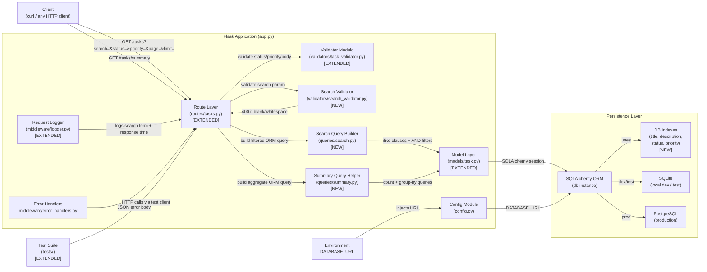
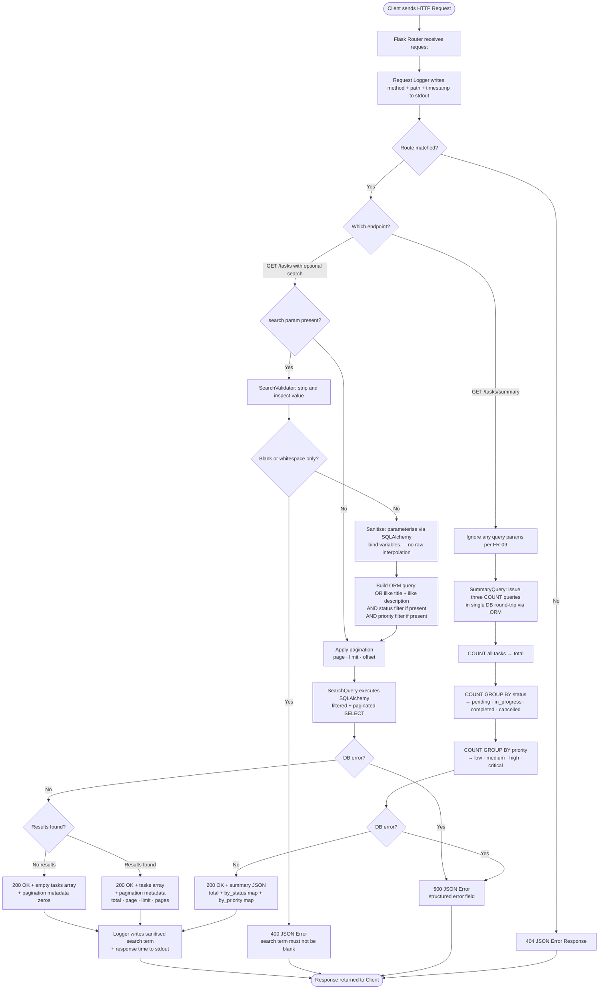

# Architecture — Task Management REST API (Search & Summary)

## Overview

This architecture extends the existing Task Management REST API with two additive capabilities: a keyword search filter on the existing `GET /tasks` endpoint and a new `GET /tasks/summary` aggregate endpoint. All changes are confined to the route, validator, model-query, and database-index layers, preserving the existing component contracts and introducing no new runtime dependencies.

## Component Diagram

## Data Flow

## Components

| Component | Responsibility | Technology |
|---|---|---|
| `app.py` | Unchanged entry point; existing DB initialisation applies new indexes on first run via updated model | Python 3.9+, Flask |
| `config.py` | Unchanged; `DATABASE_URL` env var continues to drive ORM target | Python `os`, python-dotenv |
| `models/task.py` **[extended]** | Adds `__table_args__` with `Index` definitions on `title`, `description`, `status`, and `priority` columns; no field changes | SQLAlchemy `Index`, Flask-SQLAlchemy |
| `routes/tasks.py` **[extended]** | Extends `GET /tasks` handler to extract and forward `search` param; registers new `GET /tasks/summary` route handler; delegates to query helpers | Flask Blueprint |
| `validators/search_validator.py` **[new]** | Stateless function `validate_search_param(value)`: strips whitespace, returns error dict if blank, returns sanitised string if valid | Python stdlib `str.strip()` |
| `validators/task_validator.py` **[extended]** | No logic changes; existing status/priority enum validation continues to apply alongside search validation | Python `datetime`, standard lib |
| `queries/search.py` **[new]** | `build_search_query(db, search, status, priority)`: composes SQLAlchemy `or_(Task.title.ilike(), Task.description.ilike())` with AND-chained status/priority filters using parameterised bind variables | SQLAlchemy `or_`, `ilike`, `and_` |
| `queries/summary.py` **[new]** | `get_summary()`: executes `db.session.query(func.count)` total plus two `GROUP BY` queries for status and priority; returns structured dict | SQLAlchemy `func.count`, `group_by` |
| `middleware/logger.py` **[extended]** | After-request hook extended to log sanitised `search` query parameter (if present) and response duration in milliseconds | Python `logging`, `time.monotonic()` |
| `middleware/error_handlers.py` | Unchanged; existing 400/404/500 global handlers cover all new error paths | Flask error handlers |
| `extensions.py` | Unchanged; shared `db` instance consumed by new query modules | Flask-SQLAlchemy |
| `tests/test_search.py` **[new]** | Tests for `GET /tasks` with `search` param: happy path match on title, match on description, case-insensitivity, combined filters, empty results (200), blank search (400), whitespace-only (400) | pytest, Flask test client |
| `tests/test_summary.py` **[new]** | Tests for `GET /tasks/summary`: correct totals, correct per-status counts, correct per-priority counts, empty-DB zero counts, query params silently ignored | pytest, Flask test client |
| `tests/test_tasks.py` **[extended]** | Existing test file gains regression assertions confirming non-search `GET /tasks` calls are unaffected by the new search plumbing | pytest, Flask test client |
| `requirements.txt` | Unchanged; no new dependencies required | pip |
| `README.md` **[extended]** | Documents `search` query parameter, `GET /tasks/summary` response schema, curl examples, and index migration note | Markdown |

## Design Decisions

| ID | Decision | Rationale |
|---|---|---|
| DD-11 | Extend `GET /tasks` rather than create a new `GET /tasks/search` endpoint | The search parameter is a filter on the existing collection resource; REST conventions favour query parameters on the collection endpoint over a separate search URL; avoids breaking changes for existing clients |
| DD-12 | Introduce `queries/` module layer for search and summary logic | Keeps route handlers thin; isolates ORM query construction for independent unit testing without HTTP context; mirrors the existing separation between `routes/` and `validators/` |
| DD-13 | Use SQLAlchemy `ilike()` with parameterised bind variables rather than raw SQL `LIKE` | SQLAlchemy parameterises all `ilike` arguments automatically, preventing SQL injection (NFR-04); `ilike` maps to `ILIKE` on PostgreSQL and `LIKE` with `LOWER()` on SQLite — no dialect branching needed |
| DD-14 | Sanitise search input by stripping whitespace in `search_validator.py` before it reaches the query builder | Single responsibility: validator owns the whitespace-blank rejection rule (FR-04) and returns a clean string; the query builder can trust its input without re-checking |
| DD-15 | Add SQLAlchemy `Index` declarations in `models/task.py` `__table_args__` | Indexes are co-located with the schema definition they belong to; they are automatically applied when `db.create_all()` runs, requiring no separate migration script for local/test environments; production migrations via Alembic will pick them up automatically |
| DD-16 | Issue the summary as three focused ORM queries (total count, GROUP BY status, GROUP BY priority) in a single route call | Keeps each query simple and readable; on PostgreSQL all three can be sent in one round-trip via connection pooling; avoids a single complex multi-aggregate query that would be harder to maintain or extend |
| DD-17 | `GET /tasks/summary` silently ignores unknown/filter query parameters | FR-09 specifies silent ignore, not rejection; this is the least-surprise behaviour for clients who may copy-paste a filtered `/tasks` URL and append `/summary` |
| DD-18 | No new dependencies introduced | `ilike`, `func.count`, `group_by`, and `or_` are all part of SQLAlchemy already present in `requirements.txt`; avoids supply-chain risk and keeps the install surface identical |
| DD-19 | Separate `tests/test_search.py` and `tests/test_summary.py` files rather than appending to existing test file | Keeps test files focused and short; failure output clearly identifies which feature area is broken; matches the modular structure already established in the project |
| DD-20 | Log sanitised search term and response duration in the after-request hook | NFR-07 requires observability of search terms and response times; extending the existing logger hook avoids adding a new middleware and keeps all request-level logging in one place |

## Tech Stack

| Layer | Choice | Why |
|---|---|---|
| Language | Python 3.9+ | Unchanged; no new language features required |
| Web Framework | Flask 3.x | Unchanged; new route and query param extraction use existing Flask `request.args` API |
| ORM | Flask-SQLAlchemy 3.x | `ilike`, `or_`, `and_`, `func.count`, `group_by` are all native SQLAlchemy Core/ORM — no upgrade or additional library needed |
| Search Filtering | SQLAlchemy `ilike()` + `or_()` | Dialect-agnostic case-insensitive substring matching; parameterised automatically, preventing injection; works identically on SQLite (dev) and PostgreSQL (prod) |
| Aggregation | SQLAlchemy `func.count()` + `group_by()` | Native ORM aggregation; no raw SQL; produces efficient `COUNT … GROUP BY` queries on both target databases |
| DB Indexes | SQLAlchemy `Index` in `__table_args__` | Declared alongside model definition; applied automatically by `db.create_all()`; satisfies NFR-03 without a separate migration tooling requirement |
| Input Validation | Extended custom validator module (Python stdlib) | Consistent with DD-06; `str.strip()` and length check require no new dependency |
| Testing | pytest + Flask test client | Unchanged; new test files follow identical fixture and assertion patterns as existing suite |
| Logging | Python stdlib `logging` + `time.monotonic()` | Unchanged logging infrastructure; `monotonic()` provides high-resolution duration measurement for NFR-07 with zero added dependencies |
| Packaging | `requirements.txt` (unchanged) | No new packages; pinned versions remain stable |